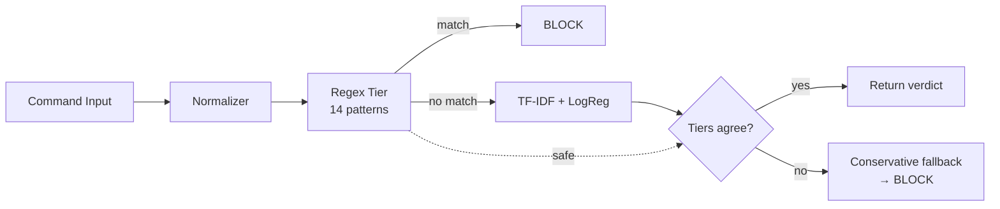

# Codebase Overview

> Classifies bash commands as malicious or benign using a two-tier pipeline: regex pre-filter (Tier 0) for unambiguous destructive patterns, then TF-IDF + logistic regression (Tier 1) for probabilistic classification, with a conservative fallback that defaults to BLOCK on disagreement.

**Last updated:** 2026-07-05
**Primary language:** Python 3.12 (uv-managed) + TypeScript (ES2022, NodeNext)
**Architecture style:** Monorepo (training in Python, inference in TypeScript)

---

## Architecture overview

The system is a two-tier command safety classifier designed for real-time inference in Node.js/Bun agentic pipelines. Training happens in Python; inference runs entirely in TypeScript with no Python runtime dependency.

**Components:**
- **Normalizer** — Preprocesses commands: strips backslash escapes, collapses whitespace, splits compound commands (`;`, `&&`, `||`).
- **Regex tier (Tier 0)** — 14 hardcoded patterns for unambiguous destructive/deceptive commands. Runs unconditionally; returns immediately on match.
- **TF-IDF tier (Tier 1)** — Logistic regression on 5,000-feature vocabulary (unigrams + bigrams). Sublinear TF scaling with IDF weighting. Produces probability of being dangerous.
- **Conservative fallback** — When regex and TF-IDF disagree, the system defaults to BLOCK. Security-critical design choice.

**Request flow:**
1. Command enters normalization (escape stripping → whitespace collapse).
2. Regex tier runs; if matched → BLOCK with confidence 1.0.
3. If no regex match → TF-IDF computes probability; threshold at 0.5.
4. If both tiers agree → return consensus verdict.
5. If they conflict → conservative fallback defaults to BLOCK.

**State:** Model artifacts (JSON) stored in `models/tfidf/`. No database, cache, or message queues.



---

## Tech stack

| Layer | Technology | Notes |
|---|---|---|
| Runtime (training) | Python 3.12 | Managed by `uv`, not pip |
| ML framework | scikit-learn | TF-IDF vectorizer + logistic regression |
| Runtime (inference) | TypeScript (ES2022, NodeNext) | Strict TypeScript, ESM modules |
| Testing | vitest 4.x | TDD-first, locked spec tests |
| Data processing | pandas, numpy | Dataset manipulation |
| Model artifacts | JSON | Vocabulary, IDF, coefficients, intercept |

---

## Entry points

| Entry | Command | Purpose |
|---|---|---|
| TypeScript API | `import { classifyCommand } from '@project/malice-classifier'` | Primary entry point for consumers |
| Test runner | `npx vitest run` (from repo root) | Runs all test suites in `tests/` |
| Type check | `npx tsc --noEmit` (from `typescript/`) | Type-checks the inference module |
| Training | `uv run training/run_local.py` | Local training pipeline runner |
| Colab | Open `training/bert_training_colab.ipynb` | Cloud training (historical) |

---

## Key modules

### TypeScript inference layer (`typescript/src/`)

| File | Purpose | Key exports |
|---|---|---|
| `types.ts` | All type definitions | `ClassificationResult`, `TFIDFResult`, `RegexRule`, `RegexMatchResult` |
| `normalizer.ts` | Command preprocessing | `normalize()`, `splitCompounds()`, `stripEscapes()`, `collapseWhitespace()` |
| `regex-rules.ts` | 14 hardcoded dangerous patterns | `REGEX_RULES`, `matchRule()` |
| `tfidf.ts` | TF-IDF + logistic regression inference | `classifyTFIDF()`, `loadModel()`, `tokenize()`, `computeTF()`, `applyIDF()`, `sigmoid()`, `predictProbability()` |
| `bert-classifier.ts` | BERT ONNX inference (preserved, not used in production) | `loadModel()`, `parseOutput()`, `validateTokenization()` |
| `classifier.ts` | Two-tier orchestrator with fallback | `classifyCommand()`, `classifyCommandSync()` |
| `index.ts` | Public API barrel export | Re-exports everything from the above modules |

### Training pipeline (`training/`)

| File | Purpose |
|---|---|
| `generate_dataset.py` | Creates synthetic training data |
| `split_dataset.py` | Stratified 70/15/15 train/val/test split |
| `phase4_tfidf.py` | Trains TF-IDF + logistic regression model |
| `validate_dataset.py` | Validates dataset integrity |
| `run_local.py` | Local pipeline orchestrator |
| `package_colab.py` | Packages notebook outputs for local use |

### Test suite (`tests/`)

| File | Purpose | Status |
|---|---|---|
| `regex.test.ts` | Locked regex patterns — 14 rules, destructive + deceptive + safe cases | LOCKED |
| `tfidf.test.ts` | Locked TF-IDF math — vocabulary, IDF, coefficients | LOCKED |
| `normalizer.test.ts` | Normalization pipeline spec | LOCKED |
| `integration.test.ts` | 35 golden commands end-to-end | LOCKED |
| `bert.test.ts` | BERT mock contract (historical) | LOCKED |
| `evaluate.ts` | Accuracy metrics across categories | Utility |
| `latency_benchmark.ts` | p50/p95/p99 latency measurement | Utility |
| `fnr_stress.ts` | False negative rate stress test (<0.5% threshold) | Utility |
| `test_commands.jsonl` | 35 golden commands with expected labels and tier assignments | Reference |

> 145 tests across 5 locked test suites. The test files define exact behavior that implementations must replicate.

---

## Data layer

**Dataset:** 56,576 commands (45.3% safe, 54.7% dangerous) stored as JSONL.

**Splits** (`data/splits/`):
- `train.jsonl` — 39,590 records (70% stratified)
- `val.jsonl` — 8,483 records (15% stratified)
- `test.jsonl` — 8,485 records (15% stratified)
- `adversarial.jsonl` — Additional adversarial/obfuscated variants

**Fields per record:**
- `command` — The shell command text
- `label` — 0 = safe/benign, 1 = dangerous/malicious
- `severity` — null (benign) or low/medium/high/critical
- `category` — filesystem, git, npm, pip, docker, sysadmin, deceptive, destructive, exfiltration, privesc, persistence, recon, adversarial
- `source` — synthetic_benign, synthetic_dangerous, adversarial
- `obfuscation_type` — none, base64, variable_substitution, comment_injection, heredoc, chaining_safe_prefix/suffix, wildcard_obfuscation, escape_injection, reverse_string, quoted_arguments, echoed_command, dry_run

**Golden commands** (35 curated test cases) are excluded from all splits to prevent data leakage.

---

## Model artifacts

TF-IDF model stored in `models/tfidf/` as JSON:

| File | Content |
|---|---|
| `vocabulary.json` | Token → index mapping (5,000 features) |
| `idf.json` | Inverse document frequency values |
| `coef.json` | Logistic regression coefficients (nested array: `[[c0, c1, ...]]`) |
| `intercept.json` | Logistic regression intercept (`[value]`) |
| `params.json` | Model parameters (ngram_range, max_features, sublinear_tf) |
| `evaluation.json` | Test set metrics |
| `threshold.json` | Optimal classification threshold (0.5) |
| `reference_predictions.jsonl` | Sample predictions for validation |

**Performance:** 99.84% accuracy, 99.94% recall (dangerous), 99.76% precision (dangerous), F1 99.85%. Latency: <1ms (TF-IDF), <0.1ms (regex).

---

## Non-obvious patterns

**Two-tier with conservative fallback, not voting**  
The system does not "vote." Regex runs first and blocks unconditionally if matched. If no regex match, TF-IDF decides. If they disagree (regex safe + TF-IDF dangerous, or vice versa), the fallback defaults to BLOCK. This is a security-first design — false positives are acceptable; false negatives are not.

**BERT-tiny was abandoned after training**  
A BERT-tiny tier was explored as a tiebreaker but produced a degenerate model (representational collapse — all inputs predicted class 1). TF-IDF alone exceeds all targets. The `bert-classifier.ts` file is preserved for reference but is not wired into the classifier orchestrator.

**Regex patterns are intentionally conservative**  
`rm -rf node_modules/` matches `rm-rf-root` at regex level. This is expected — regex is the most conservative tier. The TF-IDF tier can override this as safe when context indicates it's benign. Never "fix" regex to be less aggressive.

**Tests are locked specifications**  
The 5 test suites in `tests/` define exact behavior. Changing `tests/regex.test.ts` changes regex requirements. Changing `tests/tfidf.test.ts` changes TF-IDF math. Implementations must produce identical matches. Always coordinate test changes with implementation.

**Compound splitting splits on all operators**  
`&&` and `||` inside quoted strings are split. This is current behavior, not a bug. Each segment is classified independently.

**Normalization is idempotent**  
Escape stripping → whitespace collapse → trim can be applied multiple times without changing the result.

**Model loading is lazy**  
`tfidf.ts` loads model artifacts from disk on first `classifyTFIDF()` call. No explicit initialization required. Module-level state holds the loaded model.

---

## Development workflow

```bash
# 1. Python environment (training only)
uv sync

# 2. TypeScript environment (inference)
cd typescript && npm install

# 3. Run all tests (from repo root)
npx vitest run

# 4. Run specific test suite
npx vitest run tests/regex.test.ts
npx vitest run tests/tfidf.test.ts

# 5. Type check
cd typescript && npx tsc --noEmit

# 6. Evaluation metrics
npx tsx tests/evaluate.ts

# 7. Latency benchmark
npx tsx tests/latency_benchmark.ts 1000

# 8. False negative stress test
npx tsx tests/fnr_stress.ts

# 9. Training pipeline
uv run training/run_local.py
```

**Linting:** Not configured.
**Type checking:** `npx tsc --noEmit` in `typescript/` directory.

---

## Architecture decisions

**Two-tier, not three — BERT abandoned**  
BERT-tiny was explored as a tiebreaker between regex and TF-IDF. Training produced a degenerate model with representational collapse (always predicts class 1). TF-IDF alone achieves 99.84% accuracy with <1ms latency, making the BERT tier unnecessary. The BERT classifier module is preserved but not used.

**Conservative fallback on disagreement**  
When regex (Tier 0) and TF-IDF (Tier 1) produce conflicting verdicts, the system defaults to BLOCK. Rationale: in a security-critical classifier, missing a dangerous command (false negative) is far worse than blocking a safe one (false positive).

**Python trains, TypeScript runs**  
Python is used only for training and model export. TypeScript loads JSON model artifacts directly — no ONNX, no Python runtime, no ML framework at inference time. This simplifies deployment and reduces attack surface.

**Regex as unconditional pre-filter**  
Regex patterns run before any ML model. If a command matches a known dangerous pattern, it's blocked immediately with confidence 1.0. No model inference needed. This provides deterministic, sub-0.1ms blocking for obvious threats.

**TF-IDF as primary decision maker**  
For commands that don't match regex patterns, TF-IDF with logistic regression provides deterministic, sub-millisecond classification. The model uses 5,000 features (unigrams + bigrams) with sublinear TF scaling and IDF weighting.

---

## Glossary

| Term | Meaning in this codebase |
|---|---|
| **Tier 0** | Regex pattern-matching pre-filter |
| **Tier 1** | TF-IDF + logistic regression classifier |
| **Golden commands** | 35 curated test cases with expected labels, excluded from training data |
| **Locked spec** | Test file that defines exact behavior implementations must match |
| **Conservative fallback** | Default to BLOCK when regex and TF-IDF disagree |
| **False negative rate (FNR)** | Percentage of dangerous commands incorrectly classified as safe |

---

## Before you change code

- **Tests are source of truth** — Changing test patterns changes classifier requirements. Always coordinate.
- **Regex is conservative by design** — `rm -rf node_modules/` matching `rm-rf-root` is expected. Don't "fix" it.
- **BERT tier is dead code** — `bert-classifier.ts` is preserved but not wired in. Do not re-enable without addressing the degenerate model issue.
- **Compound splitting splits everywhere** — `&&` and `||` inside quotes are split. Current behavior.
- **Normalization is idempotent** — Safe to apply multiple times. Don't add non-idempotent steps.
- **TypeScript uses ESM** — `"type": "module"` in package.json. Use `import` not `require`.
- **Python uses uv** — Not pip. Use `uv add` for dependencies, `uv run` for scripts.
- **No CI/CD configured** — Tests run locally only.
- **Model loading is lazy** — No explicit init required. Module-level state in `tfidf.ts`.
