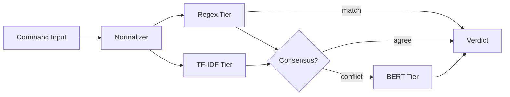

# Codebase Overview

> Classifies bash commands as malicious or benign using a three-tier voting system: regex pre-filter, TF-IDF fast-path, and BERT-tiny tiebreaker, with ONNX export for zero-dependency TypeScript inference.

**Last updated:** 2026-07-04  
**Primary language:** Python 3.12 (uv-managed) + TypeScript (ES2022, NodeNext)  
**Architecture style:** Monorepo (training in Python, inference in TypeScript)

---

## Architecture overview

The system is a three-tier voting classifier designed for real-time command safety evaluation. The architecture splits training (Python) from inference (TypeScript) via ONNX model exports, eliminating Python dependencies at runtime.

**Components:**
- **Regex tier** — Pattern-matching pre-filter for unambiguous destructive commands. Runs unconditionally and returns immediately if matched.
- **TF-IDF tier** — Deterministic fast-path using logistic regression on term frequency features. Sublinear TF scaling with IDF weighting.
- **BERT tier** — Tiebreaker using a fine-tuned BERT-tiny model exported to ONNX. Only invoked when regex and TF-IDF tiers disagree.
- **TypeScript inference layer** — Loads ONNX models via `@huggingface/transformers` for production deployment.
- **Python training pipeline** — Generates synthetic data, trains models, exports to ONNX format.

**Request flow:**
1. Command enters normalization (escape stripping, whitespace collapse, compound splitting).
2. Regex tier runs unconditionally; if matched → block/approve immediately.
3. TF-IDF tier runs in parallel; computes probability via logistic regression.
4. If regex and TF-IDF agree → return consensus verdict.
5. If they conflict → invoke BERT tier for tiebreaker decision.

**State:** Model artifacts (ONNX, pickle) stored in `models/` subdirectories. No database, cache, or message queues.



---

## Tech stack

| Layer | Technology | Notes |
|---|---|---|
| Runtime (training) | Python 3.12 | Uses `uv` for dependency management, not pip |
| ML framework | scikit-learn, transformers, torch | TF-IDF + logistic regression, BERT fine-tuning |
| Model export | ONNX via optimum | Zero Python dependency at inference time |
| Runtime (inference) | TypeScript (ES2022, NodeNext) | Strict TypeScript, ESM modules |
| Inference engine | @huggingface/transformers | Loads ONNX models directly in Node.js |
| Testing | vitest | TDD-first approach with locked spec tests |
| Data processing | pandas, numpy | Dataset manipulation and feature engineering |
| FastText | fasttext | Optional for subword tokenization experiments |

---

## Entry points

| Entry | Command | Purpose |
|---|---|---|
| Python placeholder | `python main.py` | Prints hello message; no logic yet |
| TypeScript placeholder | `npx tsx typescript/src/index.ts` | Empty export; Phase 2+ |
| Test runner | `npx vitest run` | Executes all test files in `tests/` |
| Training scripts | `uv run training/*.py` | Phase 3: dataset generation and model training |

---

## Key modules

| Path | Responsibility |
|---|---|
| `tests/` | TDD specifications — locked regex patterns, TF-IDF math, BERT contracts. **Source of truth for classifier behavior.** |
| `tests/test_commands.jsonl` | 35 golden commands with expected labels and tier assignments. Used by integration tests. |
| `tests/regex.test.ts` | Locked regex patterns that implementation must match exactly. |
| `tests/tfidf.test.ts` | Locked TF-IDF math: vocabulary, IDF values, logistic regression coefficients. |
| `tests/bert.test.ts` | Mock BERT pipeline contract: loading, tokenization, output parsing. |
| `tests/normalizer.test.ts` | Normalization pipeline spec: escape stripping, whitespace collapse, compound splitting. |
| `tests/integration.test.ts` | End-to-end voting classifier logic with consensus/conflict resolution. |
| `tests/evaluate.ts` | Evaluation script for accuracy metrics across categories and tiers. |
| `tests/latency_benchmark.ts` | Performance benchmarking for classifier latency (p50/p95/p99). |
| `tests/fnr_stress.ts` | False negative rate stress test with 0.5% threshold. |
| `typescript/src/` | Future TypeScript implementation of classifier modules. |
| `training/` | Future Python scripts for dataset generation and model training. |
| `models/` | Future ONNX and pickle model artifacts. |
| `data/` | Future raw, synthetic, processed, and split datasets. |

> ⚠️ **Tests are locked specs** — The test files define exact behavior that implementations must replicate. Changing test patterns changes classifier requirements. Always coordinate test changes with implementation changes.

---

## Data layer

**Currently empty** — Phase 3 pending. Planned structure:

- `data/raw/` — Raw datasets (JSONL format, e.g., UCI shell commands)
- `data/synthetic/` — Generated training examples
- `data/processed/` — Feature-engineered datasets
- `data/splits/` — Train/validation/test splits
- `data/reports/` — Evaluation reports and metrics

Data format: JSONL with fields like `command`, `label`, `category`, `source`.

---

## Non-obvious patterns

**TDD-first with locked specs**  
Tests are written before implementation and define exact behavior. The regex patterns in `tests/regex.test.ts` are the source of truth — implementations must produce identical matches. The TF-IDF math in `tests/tfidf.test.ts` specifies exact vocabulary, IDF values, and coefficients. Never modify tests without understanding the classifier architecture.

**Three-tier voting with consensus/conflict resolution**  
The classifier doesn't use a single model. Regex and TF-IDF run in parallel; if they agree, that's the verdict. Only when they conflict does BERT break the tie. This design optimizes for speed (most decisions made by fast tiers) while maintaining accuracy (BERT catches edge cases).

**Python trains, TypeScript runs**  
Python is used only for training and ONNX export. TypeScript loads ONNX models via `@huggingface/transformers` for inference. This eliminates Python dependencies in production. The `models/` directory stores ONNX files that TypeScript consumes.

**Regex patterns are conservative**  
The regex tier flags `rm -rf node_modules/` as dangerous (matches `rm-rf-root`). This is intentional — regex is the most conservative tier. Higher tiers (TF-IDF, BERT) can override this as safe when context indicates it's benign.

**Compound command splitting**  
Commands like `ls -la; rm -rf /` are split on `;`, `&&`, `||` operators. Each segment is classified independently. The final verdict is dangerous if any segment is dangerous.

**Normalization is idempotent**  
The normalization pipeline (escape stripping → whitespace collapse → trim) can be applied multiple times without changing the result. This is tested explicitly.

---

## Development workflow

```bash
# 1. Python environment (uv)
uv sync

# 2. TypeScript environment
cd typescript && npm install

# 3. Run all tests (TDD)
npx vitest run

# 4. Run specific test suite
npx vitest run tests/regex.test.ts
npx vitest run tests/tfidf.test.ts
npx vitest run tests/bert.test.ts

# 5. Run evaluation metrics
npx tsx tests/evaluate.ts

# 6. Run latency benchmark
npx tsx tests/latency_benchmark.ts 1000

# 7. Run false negative stress test
npx tsx tests/fnr_stress.ts

# 8. Training (Phase 3)
uv run training/generate_dataset.py
uv run training/train_models.py
```

**Linting:** Not configured yet.  
**Type checking:** `npx tsc --noEmit` in `typescript/` directory.

---

## Architecture decisions

**ONNX for zero-dependency inference**  
Models are exported from Python to ONNX format. TypeScript loads them via `@huggingface/transformers` without requiring Python, PyTorch, or scikit-learn at runtime. This simplifies deployment and reduces container size.

**TF-IDF as fast-path**  
TF-IDF with logistic regression provides deterministic, sub-millisecond classification for most commands. It's computationally cheap and doesn't require GPU. Used as the primary decision maker when regex doesn't match.

**BERT as tiebreaker only**  
BERT-tiny is invoked only when regex and TF-IDF disagree. This minimizes inference latency for the majority of commands while maintaining accuracy for ambiguous cases.

**Test-first development**  
All classifier behavior is defined in test specifications before implementation. This ensures implementations match exact requirements and prevents drift.

**Conservative regex tier**  
Regex patterns are intentionally broad to catch obvious dangerous commands. False positives are acceptable at this tier because higher tiers can override.

---

## Glossary

| Term | Meaning in this codebase |
|---|---|
| **Tier** | One of the three classification layers (regex, TF-IDF, BERT) |
| **Voting classifier** | System that combines multiple classifiers to produce a final verdict |
| **Consensus** | When regex and TF-IDF tiers agree on a verdict |
| **Conflict** | When regex and TF-IDF tiers disagree, triggering BERT tiebreaker |
| **Locked spec** | Test file that defines exact behavior implementations must match |
| **Golden commands** | Curated set of 35 commands with expected labels for integration testing |
| **False negative rate (FNR)** | Percentage of dangerous commands incorrectly classified as safe |

---

## Before you change code

- **Tests are source of truth** — Changing `tests/regex.test.ts` changes regex requirements. Changing `tests/tfidf.test.ts` changes TF-IDF math. Always coordinate with implementation.
- **Regex patterns are conservative** — `rm -rf node_modules/` is expected to match `rm-rf-root`. This is by design.
- **Compound splitting splits everywhere** — `&&` and `||` inside quoted strings are split. This is current behavior, not a bug.
- **Normalization is idempotent** — Can be applied multiple times safely. Don't add non-idempotent normalization steps.
- **BERT tier is mock only** — Current BERT tests use mocks. Real ONNX inference will have different latency characteristics.
- **Data directories are empty** — Phase 3 pending. Don't assume data exists.
- **No CI/CD configured** — Tests run locally only.
- **Python uses uv** — Not pip. Use `uv add` for dependencies, `uv run` for scripts.
- **TypeScript uses ESM** — `"type": "module"` in package.json. Use `import` not `require`.
